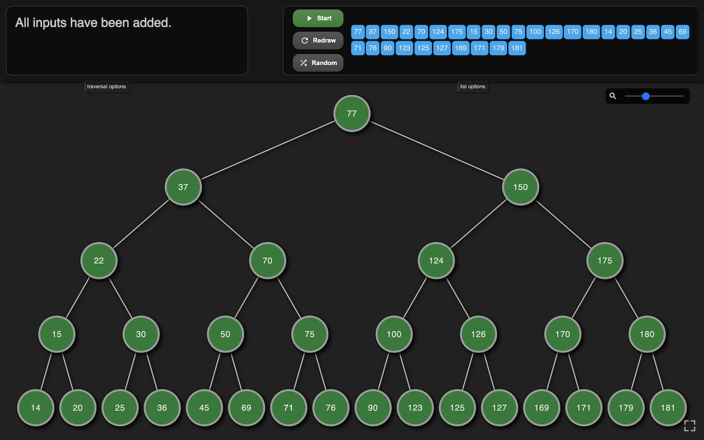

Author:  Julian Manders-Jones

Date:  2024

# Binary Search Tree Visualiser

   
Welcome to the **Binary Search Tree (BST) Visualizer**, an interactive tool designed for learners, educators, and developers interested in deepening their understanding of binary search trees. This app offers a dynamic approach to studying BSTs by enabling users to visually interact with and manipulate the tree structure.

With this tool, users can perform operations like insertion, deletion, and traversal of nodes, exploring the nuanced mechanics of BSTs firsthand. The app’s range of features makes it adaptable to all levels of experience, from beginner to advanced.

## Key Features

- **Add Node**: Insert nodes one-by-one or as a list. Supports numerical and text-based data types, allowing greater flexibility.
- **Delete Node**: Step through the process of node deletion to see how the tree rebalances.
- **Step-by-Step Traversals**: Step through in-order, pre-order, and post-order traversals, observing the traversal path interactively.
- **Step-by-Step Insertions & Deletions**: Break down complex tree operations by stepping through each change in the tree structure.
- **Automatic Tree Creation**: Auto-generate trees of various sizes and configurations, perfect for quick demonstrations or random explorations.
- **Visualize Large Trees**: Easily navigate and visualize large trees, making it possible to work with more complex datasets.
- **Multiple Data Types**: Support for both numerical and text-based lists, enhancing educational and practical applications.
- **Pan and Zoom**: Use panning and zooming controls to explore the tree’s layout and focus on areas of interest.
- **Smooth Animations and Highlights**: Key nodes are highlighted during each operation, with smooth transitions that make structural changes easy to follow.

## How to Use

1. **Add Nodes**: Enter a list of values separated by commas in the input box and click "Add" to see the BST constructed with those values.
2. **Delete Nodes**: Select a node for deletion, and the tree will rebalance accordingly.
3. **Traverse**: Choose a traversal method (in-order, pre-order, post-order) to step through and visualize each traversal path.
4. **Auto-Create Trees**: Use the randomization feature to automatically generate a tree. It’s a great way to explore different structures without manual input.
5. **Adjust the View**: Use pan and zoom controls to navigate around large trees, so you can focus on specific areas without losing sight of the overall structure.

## Download

You can install the **Binary Search Tree Visualizer** on macOS. Download the **DMG file** [here](https://github.com/iteacher/bstvisualiser/releases/tag/v1.0.1), compatible with macOS 10.14 (Mojave) and above.

You can simply downlaod the source and run the index.html on any device.

### Installation Instructions

1. **Download the DMG**: [Download here](https://github.com/iteacher/bstvisualiser/releases/tag/v1.0.1).
2. After extracting the .dmg, use the following command in the terminal to bypass Gatekeeper as it is an unsigned app.
   `xattr -cr /path/to/your/downloaded/file.dmg` 
4. **Open the DMG File**: Locate the downloaded file and double-click to open.
5. **Drag to Applications**: Drag the app icon into the **Applications** folder to install.
6. **Launch the App**: Open the app from your **Applications** folder.

---

## Educational Value

The Binary Search Tree Visualizer brings the complexities of BST operations to life, making it an invaluable tool for students and teachers. It offers hands-on, interactive ways to observe the tree’s behavior during insertions, deletions, and traversals, supporting a deeper, more intuitive understanding of data structures.

By using this tool, learners can gain insights into real-world applications of BSTs and practice fundamental computer science concepts in a highly visual way. This app is especially useful for:

- **Classroom Demonstrations**: Teachers can visually demonstrate BST operations step-by-step.
- **Self-Study**: Students can experiment on their own, testing various configurations and operations.
- **Developers**: For those in software development, this app provides a quick and interactive reference for BST behaviors.

## Contributing

We welcome contributions from the community! Whether you're interested in expanding functionality, fixing bugs, or enhancing the user experience, your input is valuable to the project.

### How to Contribute

1. **Fork the Repository**: Begin by forking this repository and cloning it locally.
2. **Set Up Your Environment**: Ensure you have a development environment with HTML, CSS, and JavaScript support.
3. **Make Your Changes**: Work on one feature or fix at a time for clarity and consistency.
4. **Submit a Pull Request**: Once your changes are complete, submit a pull request detailing what you've added or modified.

### Potential Feature Ideas

- Additional tree operations like rotations (for balanced trees like AVL or Red-Black Trees)
- Enhanced animations or interaction effects
- Localization support for international users

---

Thank you for exploring the Binary Search Tree Visualizer! We hope this app enhances your understanding and appreciation of BSTs. Download, explore the code, and feel free to contribute to make this educational tool even more powerful and accessible.
